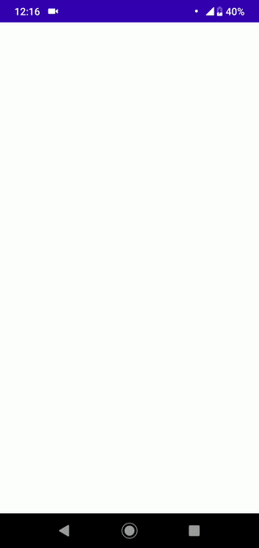

# Koleton

> The easiest library to show skeleton screens in an Android app.


[](https://bintray.com/ericktijerou/maven/koleton/_latestVersion)

[](https://kotlinlang.org)

An Android library that provides an easy way to show skeleton of any view.

Koleton is an acronym for: **Ko**tlin ske**leton**.

Made with ❤ by [ericktijerou](https://ericktijerou.com/).



## Installation
You can [download](https://bintray.com/ericktijerou/maven/koleton/_latestVersion) and install `Koleton` with `Maven` and `Gradle`:

```gradle
// In your module's `build.gradle.kts`
dependencies {
    implementation("com.ericktijerou.koleton:koleton:0.5.0")
}
```

Make sure to include `jcenter()` in your repositories
```gradle
repositories {
  jcenter()
}
```

## Quick Start
To load the skeleton of a `View`, use the `loadSkeleton` extension function:

```kotlin
// Any View
constraintLayout.loadSkeleton()

// RecyclerView
recyclerView.loadSkeleton(R.layout.item_example)
```

Skeletons can be configured with an optional trailing lambda:

```kotlin
constraintLayout.loadSkeleton {
    color(R.color.colorSkeleton)
    cornerRadius(radiusInPixel)
    shimmer(false)
}
```

To hide the skeleton, use the `hideSkeleton` extension function:

```kotlin
view.hideSkeleton()
```

## License

       Copyright 2020 ericktijerou

       Licensed under the Apache License, Version 2.0 (the "License");
       you may not use this file except in compliance with the License.
       You may obtain a copy of the License at

           http://www.apache.org/licenses/LICENSE-2.0

       Unless required by applicable law or agreed to in writing, software
       distributed under the License is distributed on an "AS IS" BASIS,
       WITHOUT WARRANTIES OR CONDITIONS OF ANY KIND, either express or implied.
       See the License for the specific language governing permissions and
       limitations under the License.