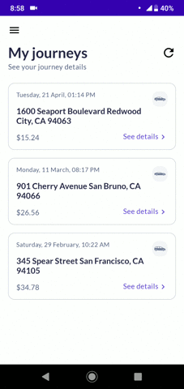

# Koleton

> The easiest library to show skeleton screens in an Android app.

[](https://bintray.com/ericktijerou/maven/koleton/_latestVersion)
[](https://travis-ci.com/ericktijerou/koleton)
[](https://kotlinlang.org)


An Android library that provides an easy way to show skeleton of any view.

Koleton is an acronym for: **Ko**tlin ske**leton**.

Made with ❤ by [ericktijerou](https://ericktijerou.com).




## Installation
You can [download](https://bintray.com/ericktijerou/maven/koleton/_latestVersion) and install `Koleton` with `Maven` and `Gradle`:

```gradle
// In your module's `build.gradle.kts`
dependencies {
    implementation("com.ericktijerou.koleton:koleton:0.7.8")
}
```

Make sure to include `jcenter()` in your repositories
```gradle
repositories {
  jcenter()
}
```

## Quick Start
To load the skeleton of a `View`, use the `loadSkeleton` extension function:

```kotlin
// Any View
constraintLayout.loadSkeleton()

// RecyclerView
recyclerView.loadSkeleton(R.layout.item_example)
```

Skeletons can be configured with an optional trailing lambda:

```kotlin
// Any View
constraintLayout.loadSkeleton {
    color(R.color.colorSkeleton)
    cornerRadius(radiusInPixel)
    shimmer(false)
    lineSpacing(spacingInPixel)
}

// RecyclerView
recyclerView.loadSkeleton(R.layout.item_example) {
    itemCount(3)
    ...
}
```

To hide the skeleton, use the `hideSkeleton` extension function:

```kotlin
view.hideSkeleton()
```

### SkeletonLoader
Koleton will lazily create a `SkeletonLoader` with the default values.
If you want to set the default values, you can set a default `SkeletonLoader` instance by either:

```kotlin
// In your Application
class MyApplication : Application(), SkeletonLoaderFactory {

    override fun newSkeletonLoader(): SkeletonLoader {
        return SkeletonLoader.Builder(this)
            ...
            .color(R.color.colorSkeleton)
            .cornerRadius(radiusInPixel)
            .build()
    }
}
```

Or calling `Koleton.setSkeletonLoader`
```kotlin
val skeletonLoader = SkeletonLoader.Builder(context)
    ...
    .color(R.color.colorSkeleton)
    .cornerRadius(radiusInPixel)
    .build()
Koleton.setSkeletonLoader(skeletonLoader)
```

The default `SkeletonLoader` can be retrieved like so:
```kotlin
val skeletonLoader = Koleton.skeletonLoader(context)
```

### Paging
Koleton works well with `Paging` library with the help of `KoletonView`.

If you want to show a skeleton when you scroll to the bottom of your list, use the `generateSkeleton` extension function:

```kotlin
// In your PagedListAdapter
override fun onCreateViewHolder(parent: ViewGroup, viewType: Int): RecyclerView.ViewHolder {
    val view = LayoutInflater.from(parent.context).inflate(R.layout.item_sample, parent, false)
    return when (viewType) {
        ...
        TYPE_SKELETON -> SkeletonViewHolder(view.generateSkeleton())
        ...
    }
}

...

class SkeletonViewHolder(val koletonView: KoletonView) : RecyclerView.ViewHolder(koletonView) {
    fun showSkeleton() {
        koletonView.showSkeleton()
    }
}
```

### Shimmer effect
Koleton works with Facebook’s [shimmer](https://github.com/facebook/shimmer-android) library. If you want to create a custom shimmer effect, you need to include in your dependencies:

```gradle
// In your module's `build.gradle.kts`
dependencies {
    implementation("com.facebook.shimmer:shimmer:0.5.0")
}
```

And set the custom shimmer in the lambda expression:

```kotlin
constraintLayout.loadSkeleton {
    val customShimmer = Shimmer.AlphaHighlightBuilder()
        .setDirection(Shimmer.Direction.TOP_TO_BOTTOM)
        ...
        .build()
    shimmer(customShimmer)
}
```


You can find more information about Facebook's shimmer effect on the [shimmer-android](http://facebook.github.io/shimmer-android) page.

## License

       Copyright 2020 ericktijerou

       Licensed under the Apache License, Version 2.0 (the "License");
       you may not use this file except in compliance with the License.
       You may obtain a copy of the License at

           http://www.apache.org/licenses/LICENSE-2.0

       Unless required by applicable law or agreed to in writing, software
       distributed under the License is distributed on an "AS IS" BASIS,
       WITHOUT WARRANTIES OR CONDITIONS OF ANY KIND, either express or implied.
       See the License for the specific language governing permissions and
       limitations under the License.